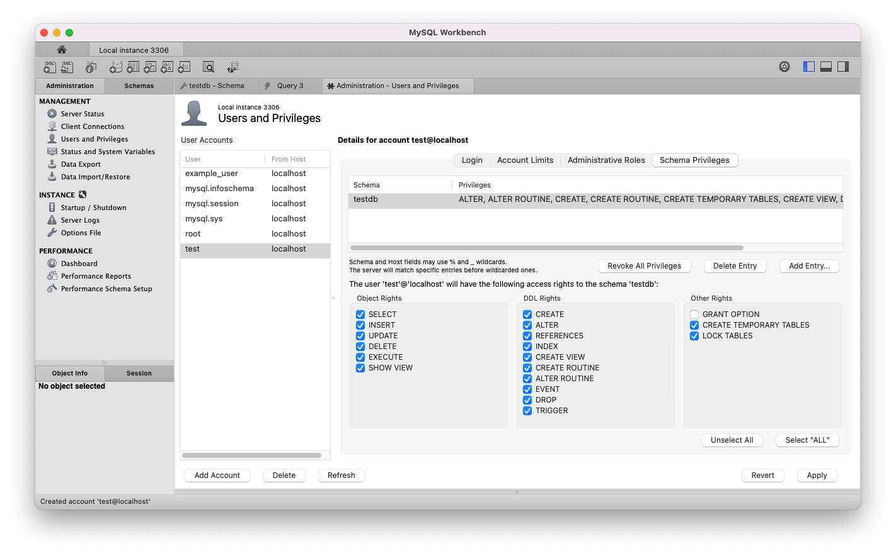

# Create Test Database

You can use MySQL Workbench to create a database for testing. Connect to the (local) MySQL instance and follow these steps.

## 1. Create `testdb` schema

1. Click on "Create a new schema in the connected server"
2. Name it "testdb"
3. Apply

## 2. Create `test` database user

Create a separate database user to use for testing. This way you won't accidentaly modify production data, and you don't have to worry about protecting the user credentials.

1. In the "Administration" tab, click on "Users and privilages", and click on "Add account"
2. Configure the user as follows:
   1. Login Name: "test"
   2. Limit to Hosts Matching: "localhost"
   3. Password: "test"

## 3. Grant `test` database user access to the `testdb` database

1.  With the `test` user selected, go to the "Schema privileges" tab and click "Add Entry..."
2.  In the "New Schema Privilge Definition" dialog:
    - Choose "Selected schema", select the "testdb" schema, and click "OK"
      
3.  In the "Schema Privileges" tab:
    - Click "Select ALL", and apply
      
